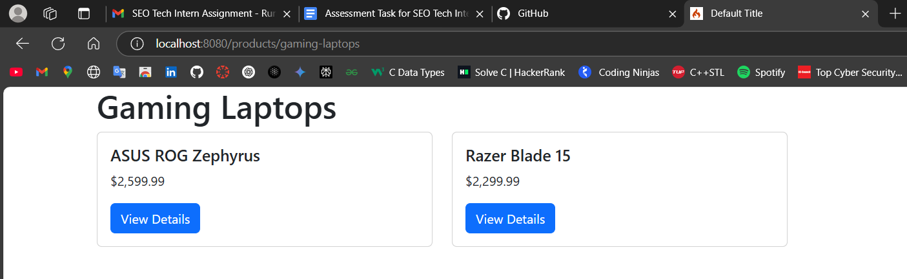

# SEO-Friendly Product Listing Platform\

 Some Sample images For Working Assignment -


  

  


  

  

  

  

------------------------------------------------------------------------

Database Images ---


-------------------------------------------------------------------------
  
## Overview
A programmatic SEO-focused product directory built with CodeIgniter (PHP MVC framework). Generates dynamic, SEO-optimized pages for categories and products with automatic technical SEO implementations.

**Key Features**:
- Dynamic product/category pages with SEO metadata
- Admin CRUD interface for content management
- Automated sitemap generation
- JSON-LD structured data
- Responsive Bootstrap UI

## Setup Instructions

### Prerequisites
- PHP 7.4+
- MySQL 5.7+
- Composer
- Apache/Nginx (or PHP built-in server)

### Installation
1. Clone repository:
```bash
git clone https://github.com/yourusername/seo-techintern-assessment.git
cd seo-techintern-assessment

 --------------------------------------------


2. Create database:-
CREATE DATABASE seo_platform;
USE seo_platform;

CREATE TABLE categories (
    id INT PRIMARY KEY AUTO_INCREMENT,
    name VARCHAR(255) NOT NULL,
    slug VARCHAR(255) NOT NULL UNIQUE,
    created_at DATETIME DEFAULT CURRENT_TIMESTAMP
);

CREATE TABLE products (
    id INT PRIMARY KEY AUTO_INCREMENT,
    title VARCHAR(255) NOT NULL,
    slug VARCHAR(255) NOT NULL UNIQUE,
    description TEXT NOT NULL,
    price DECIMAL(10,2) NOT NULL,
    features TEXT NOT NULL,
    category_id INT NOT NULL,
    created_at DATETIME DEFAULT CURRENT_TIMESTAMP,
    FOREIGN KEY (category_id) REFERENCES categories(id)
);

----------------------------------
3. Install dependencies:
composer install

------------------------------------------------

4. Configure environment:
cp .env.example .env
Edit .env:
app.baseURL = 'http://localhost:8080'
database.default.hostname = localhost
database.default.database = seo_platform
database.default.username = root
database.default.password = your_password

------------------
Run application:
php spark serve
